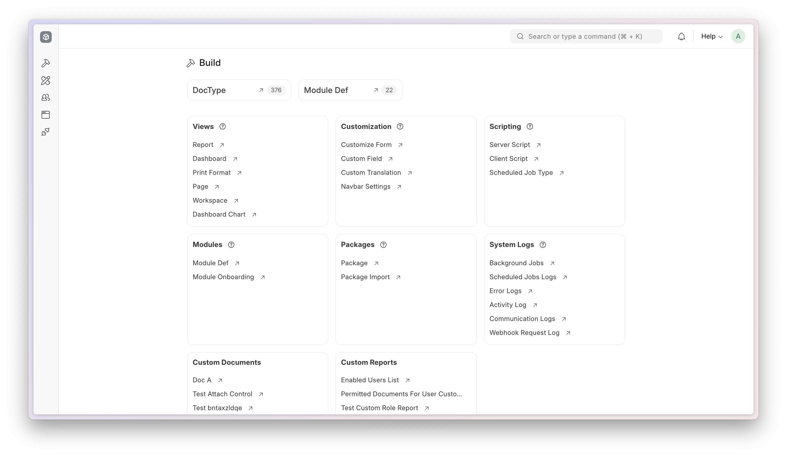
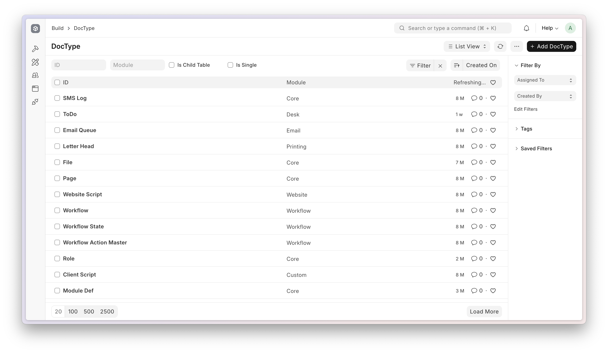
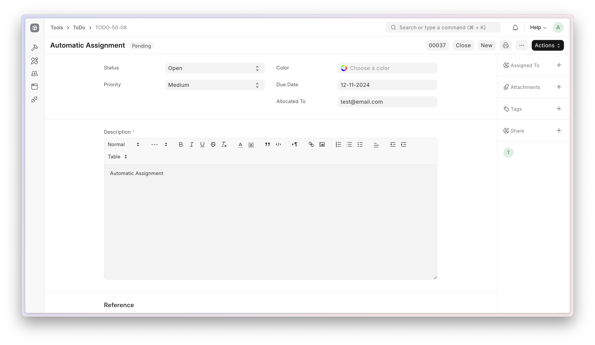
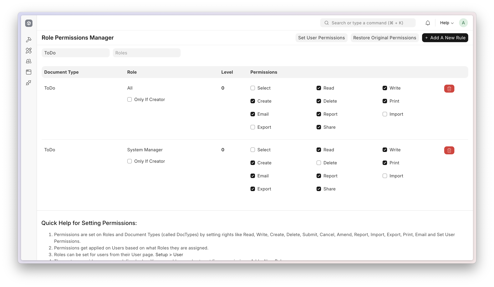

<div align="center" markdown="1">
	
	<h1>Ragapp Framework</h1>

 **Low Code Web Framework For Real World Applications, In Python And JavaScript**
</div>

<div align="center">
	<a target="_blank" href="#LICENSE" title="License: MIT"></a>
	<a href="https://codecov.io/gh/khulnasoft/ragapp"></a>
</div>
<div align="center">
	
</div>
<div align="center">
    <a href="https://ragapp.khulnasoft.com/framework">Website</a>
    -
    <a href="https://docs.ragapp.khulnasoft.com/framework">Documentation</a>
</div>

## Ragapp Framework
Full-stack web application framework that uses Python and MariaDB on the server side and a tightly integrated client side library. Built for NxERP.

### Motivation
Started in 2005, Ragapp Framework was inspired by the Semantic Web. The "big idea" behind semantic web was of a framework that not only described how information is shown (like headings, body etc), but also what it means, like name, address etc.

By creating a web framework that allowed for easy definition of metadata, it made building complex applications easy. Applications usually designed around how users interact with a system, but not based on semantics of the underlying system. Applications built on semantics end up being much more consistent and extensible. The first application built on Framework was NxERP, a beast with more than 700 object types. Framework is not for the light hearted - it is not the first thing you might want to learn if you are beginning to learn web programming, but if you are ready to do real work, then Framework is the right tool for the job.

### Key Features

- **Full-Stack Framework**: Ragapp covers both front-end and back-end development, allowing developers to build complete applications using a single framework.

- **Built-in Admin Interface**: Provides a pre-built, customizable admin dashboard for managing application data, reducing development time and effort.

- **Role-Based Permissions**: Comprehensive user and role management system to control access and permissions within the application.

- **REST API**: Automatically generated RESTful API for all models, enabling easy integration with other systems and services.

- **Customizable Forms and Views**: Flexible form and view customization using server-side scripting and client-side JavaScript.

- **Report Builder**: Powerful reporting tool that allows users to create custom reports without writing any code.

<details>
<summary>Screenshots</summary>




</details>

## Production Setup

### Managed Hosting

You can try [Ragapp Cloud](https://ragappcloud.com), a simple, user-friendly and sophisticated [open-source](https://github.com/khulnasoft/press) platform to host Ragapp applications with peace of mind.

It takes care of installation, setup, upgrades, monitoring, maintenance and support of your Ragapp deployments. It is a fully featured developer platform with an ability to manage and control multiple Ragapp deployments.

<div>
    <a href="https://ragappcloud.com/" target="_blank">
        <picture>
            <source media="(prefers-color-scheme: dark)" srcset="https://ragapp.khulnasoft.com/files/try-on-fc-white.png">
            
        </picture>
    </a>
</div>

### Self Hosting

### Docker
Prerequisites: docker, docker-compose, git. Refer [Docker Documentation](https://docs.docker.com) for more details on Docker setup.

Run following commands:

```
git clone https://github.com/khulnasoft/ragapp_docker
cd docker
docker compose -f pwd.yml up -d
```

After a couple of minutes, site should be accessible on your localhost port: 8080. Use below default login credentials to access the site.
- Username: Administrator
- Password: admin

See [Ragapp Docker](https://github.com/khulnasoft/ragapp_docker?tab=readme-ov-file#to-run-on-arm64-architecture-follow-this-instructions) for ARM based docker setup.

## Development Setup
### Manual Install

The Easy Way: our install script for cli will install all dependencies (e.g. MariaDB). See https://github.com/khulnasoft/cli for more details.

New passwords will be created for the Ragapp "Administrator" user, the MariaDB root user, and the ragapp user (the script displays the passwords and saves them to ~/ragapp_passwords.txt).

### Local

To setup the repository locally follow the steps mentioned below:

1. Setup cli by following the [Installation Steps](https://docs.ragapp.khulnasoft.com/framework/user/en/installation) and start the server
   ```
   cli start
   ```

2. In a separate terminal window, run the following commands:
   ```
   # Create a new site
   cli new-site ragapp.dev

   # Map your site to localhost
   cli --site ragapp.dev add-to-hosts
   ```

3. Open the URL `http://ragapp.dev:8000/app` in your browser, you should see the app running

## Learning and community

1. [Ragapp School](https://ragapp.school) - Learn Ragapp Framework and NxERP from the various courses by the maintainers or from the community.
2. [Official documentation](https://docs.ragapp.khulnasoft.com/framework) - Extensive documentation for Ragapp Framework.
3. [Discussion Forum](https://discuss.ragapp.khulnasoft.com/) - Engage with community of Ragapp Framework users and service providers.
4. [buildwithhussain.dev](https://buildwithhussain.dev) - Watch Ragapp Framework being used in the wild to build world-class web apps.

## Contributing

1. [Issue Guidelines](https://github.com/khulnasoft/erpnext/wiki/Issue-Guidelines)
1. [Report Security Vulnerabilities](https://ragapp.khulnasoft.com/security)
1. [Pull Request Requirements](https://github.com/khulnasoft/erpnext/wiki/Contribution-Guidelines)

<br>
<br>
<div align="center">
	<a href="https://ragapp.khulnasoft.com" target="_blank">
		<picture>
			<source media="(prefers-color-scheme: dark)" srcset="https://ragapp.khulnasoft.com/files/Ragapp-white.png">
			
		</picture>
	</a>
</div>
